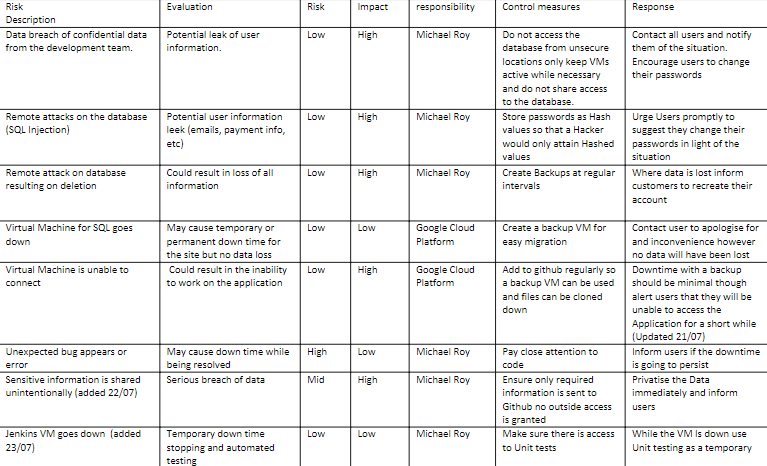
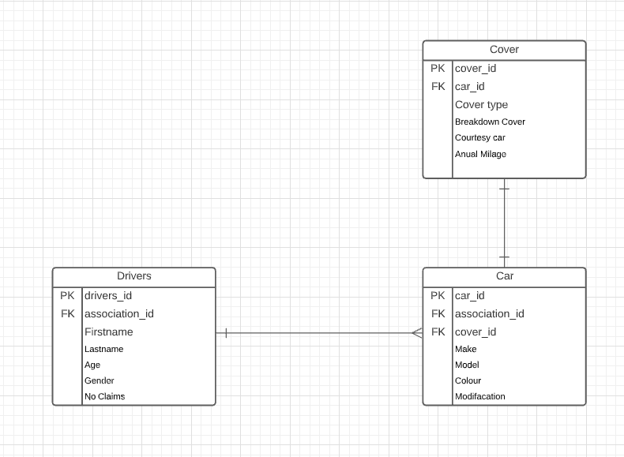
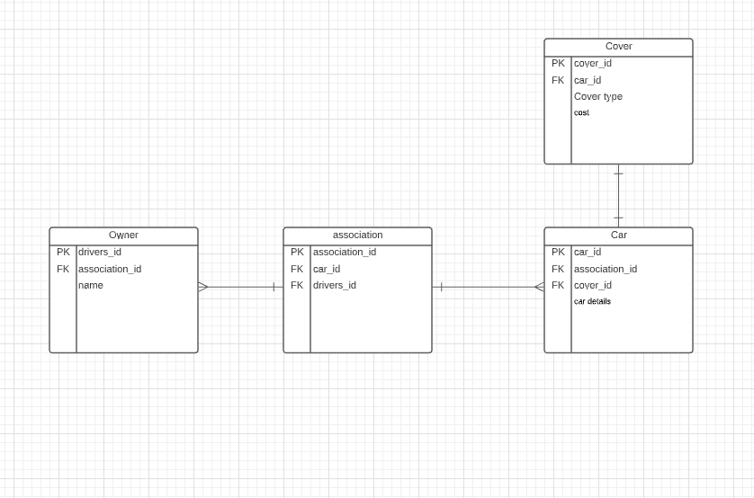
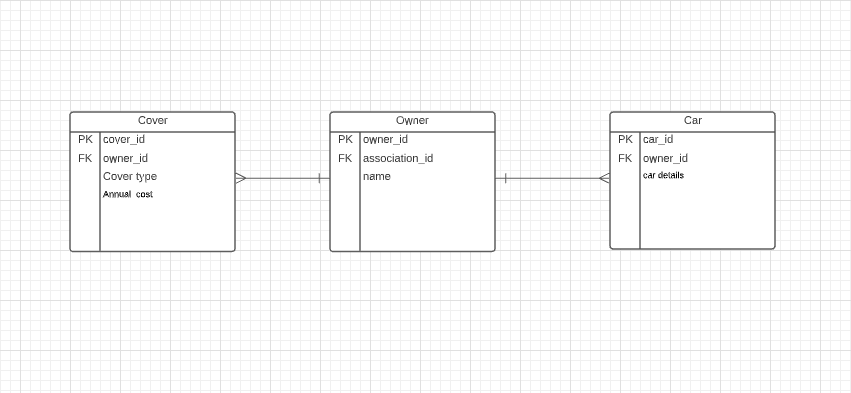
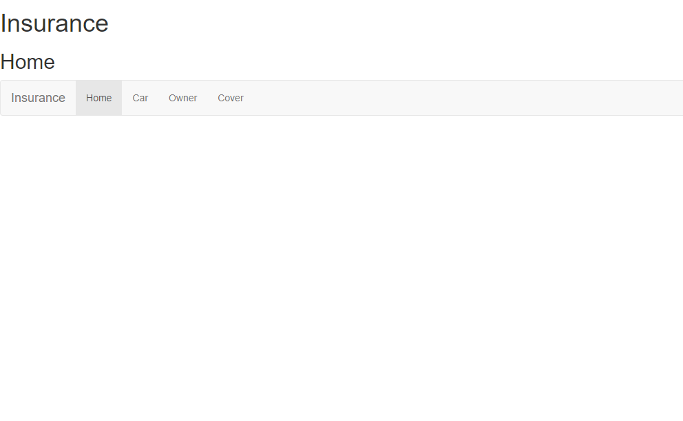
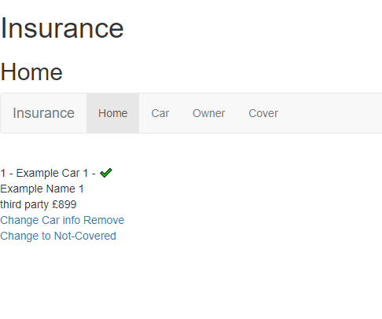

# Insurance

## Introduction

### The objective provided for this project is as follows:

To create a CRUD application with utilisation of supporting tools, methodologies and technologies that encapsulate all core modules covered during training.

## Requirements:

Functioning CRUD application created in Python 
Functioning front-end to website using Flask 
Trello board or equivalent 
Relational database - must contain at least one one-to-many relationship 
Clear documentation 
Detailed risk assessment 
Automated tests 
Fully integrated into Github or other VCS 

## Proposal

I decided to create an insurance site where you could imput your car description and personal information and view your insurance details.

###  How CRUD plays a part is as follows:

### Create:
Adding Owner information  
Adding Car information 
Adding Insurance information
    
### Read:
Able to view car,peronal and  
insurance information on one page

### Update:
Make changes to car details
    

### Delete:
Remove a Car from the insurance

## Risk Assessment

This is how i kept note of thigns i need to be aware of at the point where a new risk would become clear of an update was needed these were marked in brackets of the date of the addition or change.

## Trello Board

I used a Trello board to try and keep track of my progress however i belive this was not fully utalised opting to primarily follow more of a to do list i had noted down to keep track of my prgress, the use of the Trello board is something i would liek to use more of in the future for a better visulisation of progress.

## Entity Relationship Diagram 

Below you can see two of my early version ERDs the first of which was created before any building had begun.

   

My final ERD looked like this

As you can see i have introduced two one to many relationships so that the Owner can be insured on differnt cars with different Cover.

## Testing

For the tests i conducted unit tests and integration tests covering 96% of the application.

### to run these tests yourself you can follow below:

    sudo apt install chromium-chromedriver -y
    sudo apt-get install python3-venv

    python3 -m venv venv
    source venv/bin/activate

    pip3 install -r requirements.txt

This will install the virtual environment

To run the unit and integration tests you can run:

    python3 -m pytest tests --cov=application --cov-report term-missing --disable-warnings
The Unit test should return as follows:

    ----------- coverage: platform linux, python 3.6.9-final-0 -----------
    Name                      Stmts   Miss  Cover   Missing
    -------------------------------------------------------
    application/__init__.py       7      0   100%
    application/forms.py         14      0   100%
    application/models.py        16      0   100%
    application/routes.py        67      4    94%   44, 106-109
    -------------------------------------------------------
    TOTAL                       104      4    96%
    ================================== 11 passed in 1.54s =====================================

## Front End

To view the application run:

    cd insurance/
    python3 create.py
    python3 app.py

Then either set the localhost with port 5000, if you have set the local host imput into your browser:

    localhost:5000/main

If you are using the IP input:

    "vm_public_ip":5000/main

This is ehat you should see

From here you can navigate throught the pages adding in owners cars and cover.

Here you can see how the CRUD functionallity comes into play giving to option to (once created) view all data and update or delete.

## Future Additions

As this app is very basic as it stands in future i would like to include the option to delete specific parts of an isurance policy as oposed to the policy as a whole. 
Also i would like to have a more formatted layout i which you could select a user to see details only regarding their policys.

### Author

Michael Roy

### Acknowledgements

Ryan Wright 
Victoria Sacre