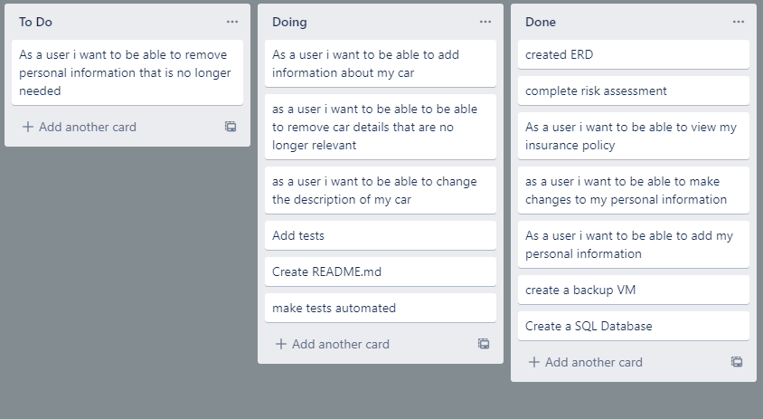

# Insurance

## Introduction

### The objective provided for this project is as follows:

To create a CRUD application with utilisation of supporting tools, methodologies and technologies that encapsulate all core modules covered during training.

## Requirements:

Functioning CRUD application created in Python
Functioning front-end to website using Flask
Trello board or equivalent
Relational database - must contain at least one one-to-many relationship
Clear documentation
Detailed risk assessment
Automated tests
Fully integrated into Github or other VCS

## Proposal

I decided to create an insurance site where you could imput your car description and personal information and view your insurance details.

###  How CRUD plays a part is as follows:

### Create:
    Adding Owner information 
    Adding Car information
    Adding Insurance information
    
### Read:
    Able to view car,peronal and 
    insurance information on one page

### Update:
    Make changes to car details
    

### Delete:
    Remove a Car from the insurance

## Risk Assessment

This is how i kept note of thigns i need to be aware of at the point where a new risk would become clear of an update was needed these were marked in brackets of the date of the addition or change.

## Trello Board

I used a Trello board to try and keep track of my progress however i belive this was not fully utalised opting to primarily follow more of a to do list i had noted down to keep track of my prgress, the use of the Trello board is something i would liek to use more of in the future for a better visulisation of progress.

## Entity Relationship Diagram 

Below you can see two of my early version ERDs the first of which was created before any building had begun

